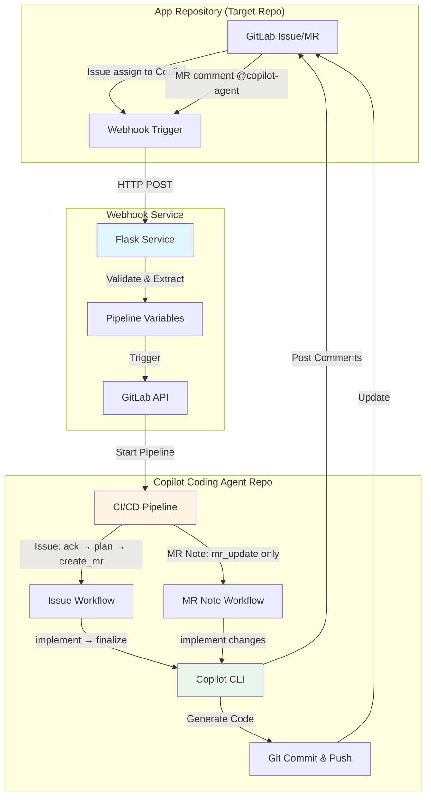

# Copilot Coding Agent with GitLab CI/CD

[中文](./README_CN.md) | English

A fully automated coding agent powered by GitHub Copilot CLI and GitLab CI/CD. This system enables autonomous code implementation through issue assignments and merge request comments. If you are interested in AI Code Review in GitLab, refer to [gitlab-copilot-code-review](https://github.com/satomic/gitlab-copilot-code-review).

## Online Example
- Public GitLab Demo Repository [app-repo-01](https://gitlab.com/agentic-devops/app-repo-01)
  - Issue: [a webhook receiver app](https://gitlab.com/agentic-devops/app-repo-01/-/issues/9)
  - MR: [Copilot Generated MR for issue #9](https://gitlab.com/agentic-devops/app-repo-01/-/merge_requests/13)
  - Update MR with comment: [@copilot-agent change reamdme to Korean](https://gitlab.com/agentic-devops/app-repo-01/-/merge_requests/15#note_2901129017)

## 🏗️ Architecture



### System Components

1. **App Repository**: Your application code repository where development happens
2. **Webhook Service**: Flask-based relay service that captures GitLab events
3. **Copilot Coding Agent Repository**: CI/CD orchestrator that runs the coding automation

### Workflow Overview

**Issue Assignment Workflow** (Full automation):
```
Issue assigned to Copilot → Webhook → Trigger Pipeline → 
Acknowledge Issue → Generate TODO Plan → Create MR → 
Implement Code → Push Changes → Update MR & Issue
```

**MR Note Workflow** (Quick updates):
```
Comment @copilot-agent in MR → Webhook → Trigger Pipeline → 
Acknowledge → Implement Changes → Push to Source Branch → 
Post Summary Comment
```

## 📋 Prerequisites

### Required Tools
- **GitLab Account** with API access
- **GitLab Runner (Docker/Kubernetes executor)** (for CI/CD execution)
- **GitHub Copilot CLI** access and subscription
- **Docker** (optional, for running webhook service in container)

### Required Permissions
- **App Repository**: Maintainer role (to receive webhooks and create MRs)
- **Copilot Coding Agent Repository**: Owner role (to configure CI/CD)
- **GitLab Personal Access Token** with scopes:
  - `api` (full API access)
  - `read_repository`
  - `write_repository`

## 🚀 Administrator Setup Guide

### Step 1: Create Copilot Bot User (Optional but Recommended)
> Suggested to create a dedicated GitLab user account for the Copilot agent for better permission management and activity auditing. You may use an existing account, but it is not recommended.

1. Create a new GitLab account named "Copilot" or similar
2. Generate a Personal Access Token for this account:
   - Go to **User Settings** → **Personal Access Tokens**
   - Token name: `copilot-automation`
   - Scopes: Select all scopes (or at minimum: `api`, `read_repository`, `write_repository`)
   - Save the token securely
   
   
3. Grant appropriate permissions to this user (choose one approach):
   - **Option A (Recommended for organization-wide use)**: Set as GitLab **Administrator** or Group **Owner**
     - This allows the Copilot user to access all repositories in the GitLab instance or group
     - More convenient for managing multiple projects
   - **Option B (Recommended for limited scope)**: Add as a member to specific App Repositories
     - Role: **Developer** or **Maintainer**
     - More granular control, suitable if you prefer restricted access
   - This user will be assigned to issues and create merge requests

### Step 2: Setup Copilot Coding Agent Repository
> Using Copilot user operations

1. **Import this repository to your GitLab via Git URL**
   - Use the Copilot user created in Step 1 as the repository owner, then import the repository to GitLab:
     ```bash
     https://github.com/satomic/gitlab-copilot-coding-agent.git
     ```
      
      
      
   - The newly imported repository's visibility should be set to Internal
      

2. **Configure CI/CD Variables**
   
   Go to **Settings** → **CI/CD** → **Variables**, add the following:

   | Variable | Description | Protected | Masked |
   |----------|-------------|-----------|--------|
   | `GITLAB_TOKEN` | Personal access token (from Step 1) | ✅ | ✅ |
   | `GITHUB_TOKEN` | GitHub Copilot CLI access token, including a valid GitHub Copilot subscription | ✅ | ✅ |

   

   Remember to change the role that can use pipeline variables to Developer
   

3. **Setup GitLab Runner**
   > If your GitLab instance already has available Runners with Docker/Kubernetes executors, you can skip this step.

   Ensure you have a GitLab Runner configured with:
   - Docker executor (recommended)
   - Access to Docker image: `satomic/copilot-cli:latest`

   if using tags, ensure the Runner has the corresponding tags, or update `.gitlab-ci.yml` as needed. New Runner registration can be completed following GitLab's page guidance, and can be registered at the project or group level. Here is an example for project level:
   

4. **Configure Copilot CLI Access**
   
   I have built the Docker image `satomic/copilot-cli:latest` which includes:
   - GitHub Copilot CLI installed
   - Authentication pre-configured, reading the `GITHUB_TOKEN` environment variable
   
   Or build your own image with Copilot CLI access.

### Step 3: Deploy Webhook Service

1. **Create `.env` file**
   ```bash
   cat > .env << EOF
   PIPELINE_TRIGGER_TOKEN=your-trigger-token, Generate in Settings → CI/CD → Pipeline trigger tokens of the repository created in Step 2
   PIPELINE_PROJECT_ID=your-project-id, This repository's project ID (found in Settings → General)
   PIPELINE_REF=main
   GITLAB_API_BASE=https://gitlab.com # Change to self-hosted instance if needed
   WEBHOOK_SECRET_TOKEN=
   COPILOT_AGENT_USERNAME=copilot-agent # GitLab ID of the Copilot bot
   COPILOT_AGENT_COMMIT_EMAIL=copilot@github.com # Email for git commits
   LISTEN_HOST=0.0.0.0
   LISTEN_PORT=8080
   EOF
   ```

   - `PIPELINE_TRIGGER_TOKEN`: Generated in **Settings** → **CI/CD** → **Pipeline trigger tokens** of the repository created in Step 2
   
   - `PIPELINE_PROJECT_ID`: This repository's project ID (found in **Settings** → **General**)
   
   - `COPILOT_AGENT_USERNAME`: GitLab ID of the Copilot bot user created in Step 1
   

2. **Run with Docker**
   ```bash
   docker run -itd \
     --name gitlab-copilot-coding-agent-hook \
     -p 8080:8080 \
     --env-file .env \
     --restart unless-stopped \
     satomic/gitlab-copilot-coding-agent-hook:latest
   ```
3. **Run from source (optional)**
   ```bash
   git clone https://github.com/satomic/gitlab-copilot-coding-agent.git
   cd gitlab-copilot-coding-agent/
   python3 main.py
   ```
4. **Hook URL**
   Obtain the public URL of the webhook service, e.g.,
   - `http://your-server-ip:8080/webhook`

### Step 4: Configure Webhooks in App Repository
> Generally, developers who want to use the Copilot coding agent only need to configure the webhook in their own app repository, without accessing the Copilot coding agent repository.

1. Go to your **App Repository** → **Settings** → **Webhooks**

2. **Create Issue Webhook**
   - URL: `http://your-server-ip:8080/webhook`
   - Secret Token: (same as `WEBHOOK_SECRET_TOKEN`)
   - Trigger: ✅ **Issues events** and ✅ **Comments** (note events)
   - Click **Add webhook**
   

3. **Test the webhook**
   - Click **Test** → **Issue events**
   - Check webhook service logs for successful reception
   - Verify HTTP 200/202 response

### Step 5: Verification

1. **Test Issue Assignment**
   - Create a test issue in App Repository
   - Assign it to the Copilot user
   
   - Watch the CI/CD pipeline trigger in Copilot Coding Agent repo
   
   - Verify MR creation and code implementation
   
   

2. **Test MR Note**
   - Create a test MR in App Repository
   - Comment: `@copilot-agent add a hello world function`
   
   - Verify pipeline execution and code changes
   

3. **Check Logs**
   ```bash
   # Webhook service logs
   docker logs -f gitlab-copilot-coding-agent-hook
   
   # Check saved webhook payloads
   ls -la hooks/
   
   # Check pipeline logs
   # Go to Copilot Coding Agent repo → CI/CD → Pipelines
   ```

## 📖 User Guide

### For Developers: Using Issue Assignment

1. **Create an Issue** in your App Repository
   ```markdown
   ## Requirements
   - Implement user authentication
   - Add password hashing
   - Create login endpoint
   - Add JWT token generation
   ```

2. **Assign to Copilot**
   - In the issue page, assign it to the "Copilot" user
   - The system will automatically start working

3. **Track Progress**
   - Copilot posts an acknowledgment comment with pipeline link
   - A merge request is created with TODO checklist
   - Code is implemented automatically
   - Final comment notifies completion

4. **Review & Merge**
   - Review the generated code in the MR
   - Request changes if needed (see MR Note usage below)
   - Approve and merge when satisfied

### For Developers: Using MR Note Commands

1. **In an Existing MR**, add a comment:
   ```
   @copilot-agent add error handling to the login function
   ```

2. **Supported Instructions**
   - Add features: `@copilot-agent add unit tests for authentication`
   - Fix bugs: `@copilot-agent fix the null pointer exception in line 45`
   - Refactor: `@copilot-agent refactor the user service to use dependency injection`
   - Update: `@copilot-agent update dependencies to latest versions`

3. **Copilot will**:
   - Acknowledge your request
   - Implement the changes
   - Commit and push to the MR branch
   - Post a summary of changes

### Best Practices

**Writing Effective Issue Descriptions**:
- Be specific about requirements
- Include acceptance criteria
- Provide context and examples
- Use checklists for multiple tasks

**Using MR Note Commands**:
- One clear instruction per comment
- Reference specific files/functions when possible
- Be concise but descriptive
- Wait for completion before next instruction

**Code Review**:
- Always review generated code
- Test the implementation
- Check for security issues
- Verify coding standards compliance

## 🔧 Configuration Reference

### Intermediate Files (Auto-excluded from Git)

The following files are generated during execution but excluded from commits:
- `patch_raw.txt` - Raw Copilot output
- `todo.md` / `todo_completed.md` - Task checklists
- `plan.json` - Execution plan
- `commit_msg.txt` - Generated commit message
- `mr_summary.txt` - Change summary

## 🐛 Troubleshooting

### Webhook Not Triggering

1. **Check webhook delivery**
   - App Repo → Settings → Webhooks → View Recent Deliveries
   - Look for 2xx status codes

2. **Verify webhook service**
   ```bash
   curl -X POST https://webhook.yourdomain.com/webhook \
     -H "Content-Type: application/json" \
     -d '{"test": true}'
   ```
   
