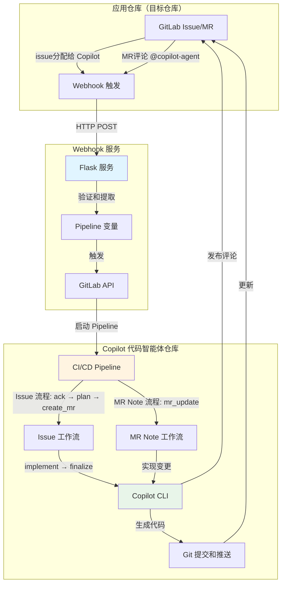

# Copilot 代码智能体（基于 GitLab CI/CD）

中文文档 | [English](./README.md)

一个由 GitHub Copilot CLI 和 GitLab CI/CD 驱动的全自动代码智能体。该系统通过 Issue 分配和 Merge Request 评论实现自主代码实现。

## 🏗️ 系统架构



### 系统组件

1. **应用仓库**：你的应用代码仓库，实际开发发生的地方
2. **Webhook 服务**：基于 Flask 的中继服务，捕获 GitLab 事件
3. **Copilot 代码智能体仓库**：运行编码自动化的 CI/CD 编排器

### 工作流概览

**Issue 分配工作流**（完整自动化）：
```
Issue 分配给 Copilot → Webhook → 触发 Pipeline → 
确认 Issue → 生成 TODO 计划 → 创建 MR → 
实现代码 → 推送变更 → 更新 MR 和 Issue
```

**MR Note 工作流**（快速更新）：
```
在 MR 中评论 @copilot-agent → Webhook → 触发 Pipeline → 
确认 → 实现变更 → 推送到源分支 → 
发布总结评论
```

## 📋 前提条件

### 必需工具
- **GitLab 账号**（具有 API 访问权限）
- **GitLab Runner (Docker/Kubernetes 执行器)**（用于 CI/CD 执行）
- **GitHub Copilot CLI** 访问权限和订阅
- **Docker**（可选，用于在容器中运行 webhook 服务）

### 必需权限
- **应用仓库**：Maintainer 角色（接收 webhook 和创建 MR）
- **Copilot 代码智能体仓库**：Owner 角色（配置 CI/CD）
- **GitLab 个人访问令牌**，具有以下作用域：
  - `api`（完整 API 访问）
  - `read_repository`
  - `write_repository`

## 🚀 管理员设置指南

### 步骤 1：创建 Copilot 机器人用户（可选但推荐）

1. 创建一个名为 "Copilot" 或类似名称的新 GitLab 账号
2. 为此账号生成个人访问令牌：
   - 前往 **Settings** → **Access Tokens**
   - 令牌名称：`copilot-automation`
   - 作用域：`api`、`read_repository`、`write_repository`
   - 安全保存令牌

3. 将此用户添加为应用仓库的成员：
   - 角色：**Developer** 或 **Maintainer**
   - 此用户将被分配 issue 并创建 merge request

### 步骤 2：设置 Copilot 代码智能体仓库

1. **克隆或 fork 此仓库**
   ```bash
   git clone https://gitlab.com/your-group/copilot-coding-agent.git
   cd copilot-coding-agent
   ```

2. **配置 CI/CD 变量**
   
   前往 **Settings** → **CI/CD** → **Variables**，添加以下变量：

   | 变量名 | 描述 | Protected | Masked |
   |--------|------|-----------|--------|
   | `GITLAB_TOKEN` | 个人访问令牌（来自步骤 1） | ✅ | ✅ |
   | `GITHUB_TOKEN` | GitHub Copilot CLI 访问令牌，包含有效的 GitHub Copilot 订阅 | ✅ | ✅ |

3. **设置 GitLab Runner**
   
   确保你有配置好的 GitLab Runner：
   - Docker 执行器（推荐）
   - 可访问 Docker 镜像：`satomic/copilot-cli:latest`
   - 标签：`docker`（或相应更新 `.gitlab-ci.yml`）

4. **配置 Copilot CLI 访问**
   
   Docker 镜像 `satomic/copilot-cli:latest` 应该包含：
   - 已安装 GitHub Copilot CLI
   - 预配置的身份验证
   
   或者构建你自己的具有 Copilot CLI 访问权限的镜像。

### 步骤 3：部署 Webhook 服务

1. **创建 `.env` 文件**
   ```bash
   cat > .env << EOF
   PIPELINE_TRIGGER_TOKEN=你的触发器令牌，在 Settings → CI/CD → Pipeline triggers 中生成
   PIPELINE_PROJECT_ID=你的项目ID，此仓库的项目 ID（在 Settings → General 中找到）
   PIPELINE_REF=main
   GITLAB_API_BASE=https://gitlab.com # 根据需要更改为自托管实例
   WEBHOOK_SECRET_TOKEN=
   COPILOT_AGENT_USERNAME=copilot-agent # Copilot 机器人的 GitLab 用户名
   COPILOT_AGENT_COMMIT_EMAIL=copilot@github.com # git 提交使用的邮箱
   LISTEN_HOST=0.0.0.0
   LISTEN_PORT=8080
   EOF
   ```

2. **使用 Docker 运行**
   ```bash
   docker run -itd \
     --name gitlab-copilot-coding-agent \
     -p 8080:8080 \
     --env-file .env \
     --restart unless-stopped \
     satomic/gitlab-copilot-coding-agent:latest
   ```
3. **源码运行（可选）**
   ```bash
   git clone https://gitlab.com/satomic/gitlab-copilot-coding-agent.git
   cd gitlab-copilot-coding-agent/webhook_service
   python3 main.py
   ```

### 步骤 4：在应用仓库中配置 Webhooks

1. 前往你的**应用仓库** → **Settings** → **Webhooks**

2. **创建 Issue Webhook**
   - URL：`https://your-webhook-service-domain.com/webhook`
   - 密钥令牌：（与 `WEBHOOK_SECRET_TOKEN` 相同）
   - 触发器：✅ **Issues events** 和 ✅ **Comments** (note events)
   - 点击 **Add webhook**

3. **测试 webhook**
   - 点击 **Test** → **Issue events**
   - 检查 webhook 服务日志是否成功接收
   - 验证 HTTP 200/202 响应

### 步骤 5：验证

1. **测试 Issue 分配**
   - 在应用仓库中创建测试 issue
   - 将其分配给 Copilot 用户
   - 观察 Copilot 代码智能体仓库中的 CI/CD pipeline 触发
   - 验证 MR 创建和代码实现

2. **测试 MR Note**
   - 在应用仓库中创建测试 MR
   - 评论：`@copilot-agent add a hello world function`
   - 验证 pipeline 执行和代码变更

3. **检查日志**
   ```bash
   # Webhook 服务日志
   docker logs gitlab-copilot-coding-agent
   
   # 检查保存的 webhook 有效载荷
   ls -la hooks/
   
   # 检查 pipeline 日志
   # 前往 Copilot 代码智能体仓库 → CI/CD → Pipelines
   ```

## 📖 用户指南

### 开发者：使用 Issue 分配

1. **在应用仓库中创建 Issue**
   ```markdown
   ## 需求
   - 实现用户认证
   - 添加密码哈希
   - 创建登录端点
   - 添加 JWT 令牌生成
   ```

2. **分配给 Copilot**
   - 在 issue 页面，将其分配给 "Copilot" 用户
   - 系统将自动开始工作

3. **跟踪进度**
   - Copilot 发布确认评论，附带 pipeline 链接
   - 创建包含 TODO 清单的 merge request
   - 自动实现代码
   - 最终评论通知完成

4. **审查和合并**
   - 在 MR 中审查生成的代码
   - 如需要可请求更改（见下方 MR Note 用法）
   - 满意后批准并合并

### 开发者：使用 MR Note 命令

1. **在现有 MR 中**，添加评论：
   ```
   @copilot-agent 为登录函数添加错误处理
   ```

2. **支持的指令**
   - 添加功能：`@copilot-agent 为认证添加单元测试`
   - 修复 bug：`@copilot-agent 修复第 45 行的空指针异常`
   - 重构：`@copilot-agent 重构用户服务以使用依赖注入`
   - 更新：`@copilot-agent 将依赖项更新到最新版本`

3. **Copilot 将会**：
   - 确认你的请求
   - 实现更改
   - 提交并推送到 MR 分支
   - 发布更改摘要

### 最佳实践

**编写有效的 Issue 描述**：
- 明确具体的需求
- 包含验收标准
- 提供上下文和示例
- 使用检查清单处理多个任务

**使用 MR Note 命令**：
- 每条评论一个清晰的指令
- 尽可能引用具体的文件/函数
- 简洁但描述性强
- 在发出下一条指令前等待完成

**代码审查**：
- 始终审查生成的代码
- 测试实现
- 检查安全问题
- 验证编码标准合规性

## 🔧 配置参考

### 中间文件（自动从 Git 排除）

执行过程中生成但从提交中排除的文件：
- `patch_raw.txt` - Copilot 原始输出
- `todo.md` / `todo_completed.md` - 任务清单
- `plan.json` - 执行计划
- `commit_msg.txt` - 生成的提交消息
- `mr_summary.txt` - 变更摘要

## 🐛 故障排除

### Webhook 未触发

1. **检查 webhook 交付**
   - 应用仓库 → Settings → Webhooks → View Recent Deliveries
   - 查找 2xx 状态码

2. **验证 webhook 服务**
   ```bash
   curl -X POST https://webhook.yourdomain.com/webhook \
     -H "Content-Type: application/json" \
     -d '{"test": true}'
   ```
