# Copilot Coding Agent สำหรับ GitLab

[English](../README.md) | [中文](./README_CN.md) | [日本語](./README_JA.md) | [हिन्दी](./README_HI.md) | [한국어](./README_KO.md) | ภาษาไทย | [العربية](./README_AR.md)

ตัวแทนเขียนโค้ดอัตโนมัติที่สมบูรณ์ซึ่งขับเคลื่อนโดย GitHub Copilot CLI และ GitLab CI/CD ระบบนี้เปิดใช้งานการดำเนินการเขียนโค้ดอัตโนมัติและการตรวจสอบโค้ดอัจฉริยะผ่านการมอบหมาย issue การแสดงความคิดเห็นใน merge request และการมอบหมายผู้ตรวจสอบ merge request

## สาธิตและตัวอย่าง
**วิดีโอสาธิต Youtube**

การตั้งค่า:
- [Copilot Coding Agent for GitLab - Setup Guide](https://www.youtube.com/watch?v=aSQVP1AAD60)

วิธีการใช้งาน:
- [Copilot Coding Agent for GitLab - How to use 2:30 – Create an issue in the app repo and assign it to Copilot](https://www.youtube.com/watch?v=med7Bfff_m4&t=150s)
- [Copilot Coding Agent for GitLab - How to use 11:24 – Let Copilot make some updates in the merge request via comments](https://www.youtube.com/watch?v=med7Bfff_m4&t=684s)

**ตัวอย่าง repository**
- GitLab Demo Repository สาธารณะ [app-repo-01](https://gitlab.com/agentic-devops/app-repo-01)
- Issue: [แอปพลิเคชัน webhook receiver](https://gitlab.com/agentic-devops/app-repo-01/-/issues/20)
- MR: [แอปพลิเคชัน webhook receiver (#20)](https://gitlab.com/agentic-devops/app-repo-01/-/merge_requests/25)
- อัปเดต MR ด้วยความคิดเห็น: [@copilot-agent เปลี่ยน readme เป็นภาษาไทย](https://gitlab.com/agentic-devops/app-repo-01/-/merge_requests/25#note_2930077924)
- การตรวจสอบโค้ด: [กำหนด Copilot เป็นผู้ตรวจสอบ MR](https://gitlab.com/agentic-devops/app-repo-01/-/merge_requests/25#note_2930095536)

## 🏗️ สถาปัตยกรรม

```mermaid
graph TB
    subgraph "App Repository (Target Repo)"
        A[GitLab Issue/MR] -->|Issue assign to Copilot| C[Webhook Trigger]
        A[GitLab Issue/MR] -->|MR comment @copilot-agent| C[Webhook Trigger]
        A[GitLab Issue/MR] -->|MR assign Copilot as Reviewer| C[Webhook Trigger]
    end

    subgraph "Webhook Service"
        C -->|HTTP POST| D[Flask Service]
        D -->|Validate & Extract| E[Pipeline Variables]
        E -->|Trigger| F[GitLab API]
    end

    subgraph "Copilot Coding Agent Repo"
        F -->|Start Pipeline| G[CI/CD Pipeline]
        G -->|Issue: ack → plan → create_mr| H[Issue Workflow]
        G -->|MR Note: mr_update only| I[MR Note Workflow]
        G -->|MR Reviewer: mr_review| L[MR Review Workflow]
        H -->|implement → finalize| J[Copilot CLI]
        I -->|implement changes| J
        L -->|perform code review| J
        J -->|Generate Code| K[Git Commit & Push]
    end

    K -->|Update| A
    J -->|Post Comments| A
    L -->|Post Review Comments| A

    style D fill:#e1f5ff
    style G fill:#fff4e1
    style J fill:#e8f5e9
```



### ส่วนประกอบของระบบ

1. **Application Repository**: repository โค้ดแอปพลิเคชันของคุณที่การพัฒนาเกิดขึ้น
2. **Webhook Service**: บริการรีเลย์ที่ใช้ Flask ซึ่งจับเหตุการณ์ของ GitLab
3. **Copilot Coding Agent Repository**: ตัวควบคุม CI/CD ที่รันการทำงานอัตโนมัติของการเขียนโค้ด

### ภาพรวมของเวิร์กโฟลว์

**เวิร์กโฟลว์การมอบหมาย Issue** (อัตโนมัติเต็มรูปแบบ):
```
มอบหมาย Issue ให้ Copilot → Webhook → ทริกเกอร์ Pipeline →
รับทราบ Issue → สร้างแผน TODO → สร้าง MR →
ดำเนินการโค้ด → Push การเปลี่ยนแปลง → อัปเดต MR และ Issue
```

**เวิร์กโฟลว์ MR Note** (อัปเดตอย่างรวดเร็ว):
```
แสดงความคิดเห็น @copilot-agent ใน MR → Webhook → ทริกเกอร์ Pipeline →
รับทราบ → ดำเนินการเปลี่ยนแปลง → Push ไปยัง Source Branch →
โพสต์ความคิดเห็นสรุป
```

**เวิร์กโฟลว์ MR Reviewer** (การตรวจสอบโค้ดอัจฉริยะ):
```
มอบหมาย Copilot เป็นผู้ตรวจสอบ MR → Webhook → ทริกเกอร์ Pipeline →
รับทราบ → วิเคราะห์การเปลี่ยนแปลงโค้ด → ดำเนินการตรวจสอบอย่างครอบคลุม →
โพสต์ความคิดเห็นการตรวจสอบโดยละเอียด
```

## 📋 ข้อกำหนดเบื้องต้น

### เครื่องมือที่ต้องการ
- **บัญชี GitLab** ที่มีการเข้าถึง API
- **GitLab Runner (Docker/Kubernetes executor)** (สำหรับการรัน CI/CD)
- การเข้าถึงและการสมัครสมาชิก **GitHub Copilot CLI**
- **Docker** (ตัวเลือก สำหรับรันบริการ webhook ในคอนเทนเนอร์)

### สิทธิ์ที่ต้องการ
- **Application Repository**: บทบาท Maintainer (เพื่อรับ webhook และสร้าง MR)
- **Copilot Coding Agent Repository**: บทบาท Owner (เพื่อกำหนดค่า CI/CD)
- **GitLab Personal Access Token** ที่มีขอบเขต:
  - `api` (การเข้าถึง API เต็มรูปแบบ)
  - `read_repository`
  - `write_repository`

## 🚀 คู่มือการตั้งค่าสำหรับผู้ดูแลระบบ

### ขั้นตอนที่ 1: สร้างผู้ใช้บอท Copilot (ตัวเลือกแต่แนะนำ)
> แนะนำให้สร้างบัญชีผู้ใช้ GitLab เฉพาะสำหรับตัวแทน Copilot เพื่อการจัดการสิทธิ์และการตรวจสอบกิจกรรมที่ดีขึ้น คุณอาจใช้บัญชีที่มีอยู่ แต่ไม่แนะนำ

1. สร้างบัญชี GitLab ใหม่ชื่อ "Copilot" หรือคล้ายกัน
2. สร้าง Personal Access Token สำหรับบัญชีนี้:
   - ไปที่ **User Settings** → **Personal Access Tokens**
   - ชื่อโทเค็น: `copilot-automation`
   - ขอบเขต: เลือกขอบเขตทั้งหมด (หรืออย่างน้อย: `api`, `read_repository`, `write_repository`)
   - บันทึกโทเค็นอย่างปลอดภัย
   

3. มอบสิทธิ์ที่เหมาะสมให้กับผู้ใช้นี้ (เลือกหนึ่งวิธี):
   - **ตัวเลือก A (แนะนำสำหรับการใช้งานทั่วทั้งองค์กร)**: ตั้งค่าเป็น GitLab **Administrator** หรือ Group **Owner**
     - สิ่งนี้ช่วยให้ผู้ใช้ Copilot เข้าถึง repository ทั้งหมดใน GitLab instance หรือกลุ่ม
     - สะดวกกว่าสำหรับการจัดการโครงการหลายโครงการ
   - **ตัวเลือก B (แนะนำสำหรับขอบเขตจำกัด)**: เพิ่มเป็นสมาชิกใน Application Repository เฉพาะ
     - บทบาท: **Developer** หรือ **Maintainer**
     - การควบคุมที่ละเอียดกว่า เหมาะสมหากคุณต้องการการเข้าถึงที่จำกัด
   - ผู้ใช้นี้จะถูกมอบหมายให้กับ issue และสร้าง merge request

### ขั้นตอนที่ 2: ตั้งค่า Copilot Coding Agent Repository
> ใช้การดำเนินการของผู้ใช้ Copilot

1. **นำเข้า repository นี้ไปยัง GitLab ของคุณผ่าน Git URL**
   - ใช้ผู้ใช้ Copilot ที่สร้างในขั้นตอนที่ 1 เป็นเจ้าของ repository จากนั้นนำเข้า repository ไปยัง GitLab:
     ```bash
     https://github.com/satomic/gitlab-copilot-coding-agent.git
     ```
      
      
      
   - การมองเห็นของ repository ที่นำเข้าใหม่ควรตั้งค่าเป็น Internal
      

2. **กำหนดค่าตัวแปร CI/CD**

   ไปที่ **Settings** → **CI/CD** → **Variables** เพิ่มดังต่อไปนี้:

   | ตัวแปร | คำอธิบาย | Protected | Masked |
   |----------|-------------|-----------|--------|
   | `GITLAB_TOKEN` | Personal access token (จากขั้นตอนที่ 1) | ✅ | ✅ |
   | `GITHUB_TOKEN` | โทเค็นการเข้าถึง GitHub Copilot CLI รวมถึงการสมัครสมาชิก GitHub Copilot ที่ถูกต้อง | ✅ | ✅ |

   เพื่อสร้าง `GITHUB_TOKEN` ซึ่งเป็น fine-grained PAT ที่เปิดใช้งานสิทธิ์ "Copilot Requests":
   - เยี่ยมชม https://github.com/settings/personal-access-tokens/new
   - ภายใต้ "Permissions" คลิก "add permissions" และเลือก "Copilot Requests"
   - สร้างโทเค็นของคุณ
   


   

   อย่าลืมเปลี่ยนบทบาทที่สามารถใช้ตัวแปร pipeline เป็น Developer
   

3. **ตั้งค่า GitLab Runner**
   > หาก GitLab instance ของคุณมี Runner ที่พร้อมใช้งานกับ Docker/Kubernetes executor อยู่แล้ว คุณสามารถข้ามขั้นตอนนี้

   ตรวจสอบให้แน่ใจว่าคุณมี GitLab Runner ที่กำหนดค่าด้วย:
   - Docker executor (แนะนำ)
   - การเข้าถึง Docker image: `satomic/copilot-cli:latest`

   หากใช้แท็ก ตรวจสอบให้แน่ใจว่า Runner มีแท็กที่สอดคล้องกัน หรืออัปเดต `.gitlab-ci.yml` ตามต้องการ การลงทะเบียน Runner ใหม่สามารถทำได้ตามคำแนะนำของหน้า GitLab และสามารถลงทะเบียนได้ที่ระดับโครงการหรือกลุ่ม นี่คือตัวอย่างสำหรับระดับโครงการ:
   

4. **กำหนดค่าการเข้าถึง Copilot CLI**

   ฉันได้สร้าง Docker image `satomic/copilot-cli:latest` ซึ่งรวมถึง:
   - GitHub Copilot CLI ติดตั้งแล้ว
   - การตรวจสอบสิทธิ์กำหนดค่าไว้ล่วงหน้า อ่านตัวแปรสภาพแวดล้อม `GITHUB_TOKEN`

   หรือสร้าง image ของคุณเองที่มีการเข้าถึง Copilot CLI

### ขั้นตอนที่ 3: ปรับใช้บริการ Webhook

1. **สร้างไฟล์ `.env`**
   ```bash
   cat > .env << EOF
   PIPELINE_TRIGGER_TOKEN=your-trigger-token, สร้างใน Settings → CI/CD → Pipeline trigger tokens ของ repository ที่สร้างในขั้นตอนที่ 2
   PIPELINE_PROJECT_ID=your-project-id, ID โครงการของ repository นี้ (พบใน Settings → General)
   PIPELINE_REF=main
   GITLAB_API_BASE=https://gitlab.com # เปลี่ยนเป็น instance ที่โฮสต์เองหากจำเป็น
   WEBHOOK_SECRET_TOKEN=
   COPILOT_AGENT_USERNAME=copilot-agent # GitLab ID ของบอท Copilot
   COPILOT_AGENT_COMMIT_EMAIL=copilot@github.com # อีเมลสำหรับ git commit
   LISTEN_HOST=0.0.0.0
   LISTEN_PORT=8080
   ENABLE_INLINE_REVIEW_COMMENTS=true
   COPILOT_LANGUAGE=th
   EOF
   ```

   - `PIPELINE_TRIGGER_TOKEN`: สร้างใน **Settings** → **CI/CD** → **Pipeline trigger tokens** ของ repository ที่สร้างในขั้นตอนที่ 2
   
   - `PIPELINE_PROJECT_ID`: ID โครงการของ repository นี้ (พบใน **Settings** → **General**)
   
   - `COPILOT_AGENT_USERNAME`: GitLab ID ของผู้ใช้บอท Copilot ที่สร้างในขั้นตอนที่ 1
   

2. **รันด้วย Docker**
   ```bash
   docker run -itd \
     --name gitlab-copilot-coding-agent-hook \
     -p 8080:8080 \
     --env-file .env \
     --restart unless-stopped \
     satomic/gitlab-copilot-coding-agent-hook:latest
   ```
3. **รันจากซอร์ส (ตัวเลือก)**
   ```bash
   git clone https://github.com/satomic/gitlab-copilot-coding-agent.git
   cd gitlab-copilot-coding-agent/
   python3 main.py
   ```
4. **Hook URL**
   รับ URL สาธารณะของบริการ webhook เช่น
   - `http://your-server-ip:8080/webhook`

### ขั้นตอนที่ 4: กำหนดค่า Webhook ใน Application Repository
> โดยทั่วไป นักพัฒนาที่ต้องการใช้ตัวแทนเขียนโค้ด Copilot จำเป็นต้องกำหนดค่า webhook ใน application repository ของตนเองเท่านั้น โดยไม่ต้องเข้าถึง Copilot coding agent repository

1. ไปที่ **Application Repository** → **Settings** → **Webhooks** ของคุณ

2. **สร้าง Webhook**
   - URL: `http://your-server-ip:8080/webhook`
   - Secret Token: (เหมือนกับ `WEBHOOK_SECRET_TOKEN`)
   - Trigger: ✅ **Issues events**, ✅ **Comments** (note events), และ ✅ **Merge request events**
   - คลิก **Add webhook**
   

3. **ทดสอบ webhook**
   - คลิก **Test** → **Issue events**
   - ตรวจสอบบันทึกบริการ webhook สำหรับการรับที่สำเร็จ
   - ตรวจสอบการตอบกลับ HTTP 200/202

### ขั้นตอนที่ 5: การตรวจสอบ

1. **ทดสอบการมอบหมาย Issue**
   - สร้าง issue ทดสอบใน Application Repository
   - มอบหมายให้กับผู้ใช้ Copilot
   
   - ดู CI/CD pipeline ทริกเกอร์ใน Copilot Coding Agent repo
   
   - ตรวจสอบการสร้าง MR และการดำเนินการโค้ด
   
   

2. **ทดสอบ MR Note**
   - สร้าง MR ทดสอบใน Application Repository
   - ความคิดเห็น: `@copilot-agent add a hello world function`
   
   - ตรวจสอบการรัน pipeline และการเปลี่ยนแปลงโค้ด
   

3. **ทดสอบ MR Reviewer**
   - สร้างหรือเปิด MR ทดสอบใน Application Repository มอบหมายผู้ใช้ Copilot เป็นผู้ตรวจสอบ
   
   - ตรวจสอบการรัน pipeline และการโพสต์ความคิดเห็นการตรวจสอบ ตรวจสอบรายงานการตรวจสอบโค้ดโดยละเอียดที่โพสต์โดย Copilot
   

4. **ตรวจสอบบันทึก**
   ```bash
   # บันทึกบริการ Webhook
   docker logs -f gitlab-copilot-coding-agent-hook

   # ตรวจสอบ webhook payload ที่บันทึกไว้
   ls -la hooks/

   # ตรวจสอบบันทึก Pipeline
   # ไปที่ Copilot Coding Agent repo → CI/CD → Pipelines
   ```

## 📖 คู่มือผู้ใช้

### สำหรับนักพัฒนา: การใช้การมอบหมาย Issue

1. **สร้าง Issue** ใน Application Repository ของคุณ
   ```markdown
   ## ข้อกำหนด
   - ดำเนินการตรวจสอบสิทธิ์ผู้ใช้
   - เพิ่มการแฮชรหัสผ่าน
   - สร้าง endpoint การเข้าสู่ระบบ
   - เพิ่มการสร้างโทเค็น JWT
   ```

2. **มอบหมายให้ Copilot**
   - ในหน้า issue มอบหมายให้กับผู้ใช้ "Copilot"
   - ระบบจะเริ่มทำงานโดยอัตโนมัติ

3. **ติดตามความคืบหน้า**
   - Copilot โพสต์ความคิดเห็นรับทราบพร้อมลิงก์ pipeline
   - สร้าง merge request พร้อมรายการตรวจสอบ TODO
   - โค้ดถูกดำเนินการโดยอัตโนมัติ
   - ความคิดเห็นสุดท้ายแจ้งการเสร็จสิ้น

   > **หมายเหตุ**: หาก merge request สำหรับ issue มีอยู่แล้ว Copilot จะตรวจจับและโพสต์การแจ้งเตือนใน issue ขอให้คุณดำเนินการต่อใน MR ที่มีอยู่แทนที่จะสร้างซ้ำ

4. **ตรวจสอบและรวม**
   - ตรวจสอบโค้ดที่สร้างใน MR
   - ขอการเปลี่ยนแปลงหากจำเป็น (ดูการใช้ MR Note ด้านล่าง)
   - อนุมัติและรวมเมื่อพอใจ

### สำหรับนักพัฒนา: การใช้คำสั่ง MR Note

1. **ใน MR ที่มีอยู่** เพิ่มความคิดเห็น:
   ```
   @copilot-agent add error handling to the login function
   ```

2. **คำแนะนำที่รองรับ**
   - เพิ่มฟีเจอร์: `@copilot-agent add unit tests for authentication`
   - แก้ไขบั๊ก: `@copilot-agent fix the null pointer exception in line 45`
   - รีแฟคเตอร์: `@copilot-agent refactor the user service to use dependency injection`
   - อัปเดต: `@copilot-agent update dependencies to latest versions`

3. **Copilot จะ**:
   - รับทราบคำขอของคุณ
   - ดำเนินการเปลี่ยนแปลง
   - Commit และ push ไปยัง MR branch
   - โพสต์สรุปการเปลี่ยนแปลง

### สำหรับนักพัฒนา: การใช้ MR Reviewer สำหรับการตรวจสอบโค้ด

1. **บนหน้า MR** มอบหมายผู้ใช้ Copilot เป็นผู้ตรวจสอบ
   - ค้นหาตัวเลือก "Reviewers" ทางด้านขวาของหน้า MR
   - เลือกผู้ใช้ Copilot (เช่น copilot-agent)

2. **Copilot จะ**:
   - ทริกเกอร์เวิร์กโฟลว์การตรวจสอบโค้ดโดยอัตโนมัติ
   - วิเคราะห์การเปลี่ยนแปลงโค้ดทั้งหมดระหว่าง source และ target branch
   - ดำเนินการตรวจสอบโค้ดอย่างครอบคลุมรวมถึง:
     - คุณภาพโค้ดและความสามารถในการบำรุงรักษา
     - แนวทางปฏิบัติที่ดีที่สุดและรูปแบบการออกแบบ
     - การตรวจสอบช่องโหว่ด้านความปลอดภัย
     - การวิเคราะห์ประสิทธิภาพ
     - การประเมินการครอบคลุมการทดสอบ
     - ความสมบูรณ์ของเอกสาร
   - โพสต์รายงานการตรวจสอบโดยละเอียดใน MR จัดหมวดหมู่ตามความรุนแรง
   - ให้คำแนะนำการปรับปรุงเฉพาะและการแก้ไขที่แนะนำ

3. **เนื้อหารายงานการตรวจสอบ**:
   - สรุปการประเมินโดยรวม
   - ปัญหาที่จัดหมวดหมู่ตามความรุนแรง (Critical, Major, Minor, Suggestions)
   - แต่ละปัญหารวมถึงตำแหน่งไฟล์ คำอธิบายโดยละเอียด และคำแนะนำการแก้ไข
   - คำแนะนำการตรวจสอบสุดท้าย: APPROVE, REQUEST_CHANGES หรือ NEEDS_DISCUSSION

### แนวทางปฏิบัติที่ดีที่สุด

**การเขียนคำอธิบาย Issue ที่มีประสิทธิภาพ**:
- เจาะจงเกี่ยวกับข้อกำหนด
- รวมเกณฑ์การยอมรับ
- ให้บริบทและตัวอย่าง
- ใช้รายการตรวจสอบสำหรับงานหลายงาน

**การใช้คำสั่ง MR Note**:
- คำแนะนำที่ชัดเจนหนึ่งรายการต่อความคิดเห็น
- อ้างอิงไฟล์/ฟังก์ชันเฉพาะเมื่อเป็นไปได้
- กระชับแต่เป็นคำอธิบาย
- รอให้เสร็จสิ้นก่อนคำแนะนำถัดไป

**การตรวจสอบโค้ด**:
- ตรวจสอบโค้ดที่สร้างเสมอ
- ทดสอบการดำเนินการ
- ตรวจสอบปัญหาด้านความปลอดภัย
- ตรวจสอบการปฏิบัติตามมาตรฐานการเขียนโค้ด

## 🔧 การอ้างอิงการกำหนดค่า

### ไฟล์ระหว่างกลาง (ยกเว้นอัตโนมัติจาก Git)

ไฟล์ต่อไปนี้ถูกสร้างขึ้นระหว่างการรัน แต่ไม่รวมในการ commit:
- `patch_raw.txt` - เอาต์พุต Copilot ดิบ
- `todo.md` / `todo_completed.md` - รายการตรวจสอบงาน
- `plan.json` - แผนการรัน
- `commit_msg.txt` - ข้อความ commit ที่สร้าง
- `mr_summary.txt` - สรุปการเปลี่ยนแปลง

## 🐛 การแก้ไขปัญหา

### Webhook ไม่ทริกเกอร์

1. **ตรวจสอบการส่ง webhook**
   - App Repo → Settings → Webhooks → View Recent Deliveries
   - มองหารหัสสถานะ 2xx

2. **ตรวจสอบบริการ webhook**
   ```bash
   curl -X POST https://webhook.yourdomain.com/webhook \
     -H "Content-Type: application/json" \
     -d '{"test": true}'
   ```

